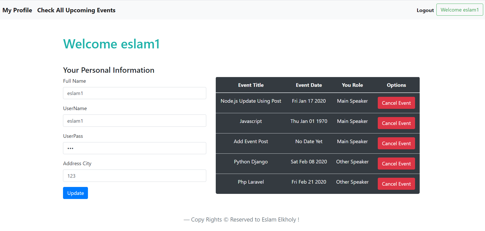
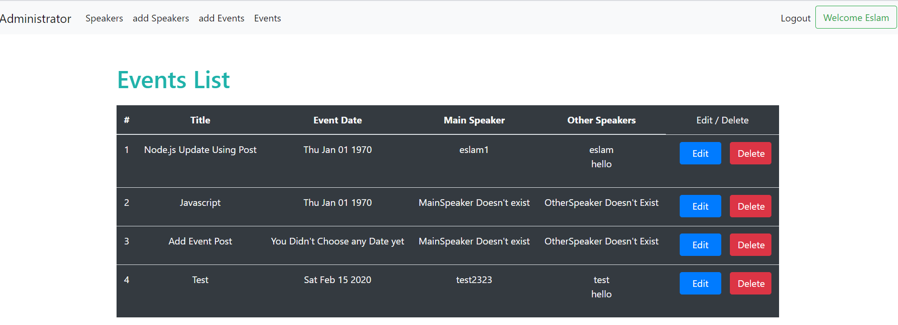
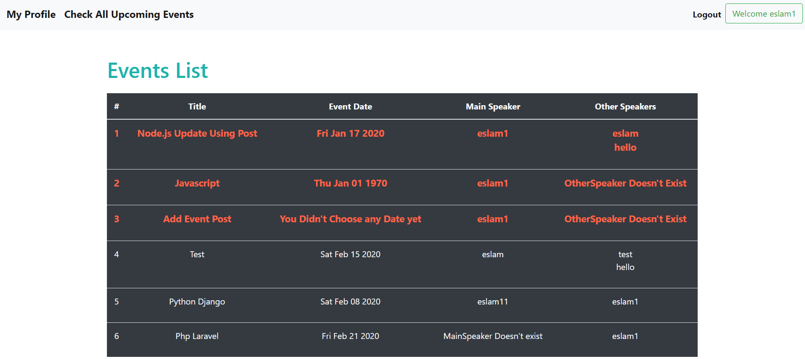
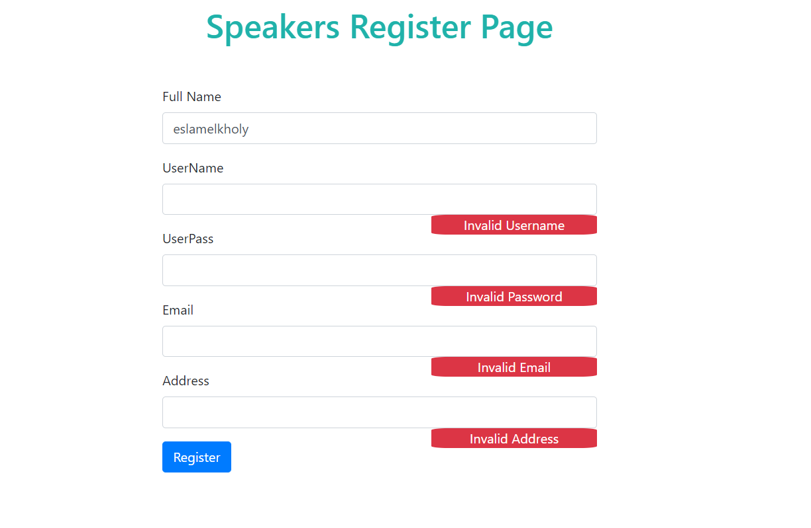
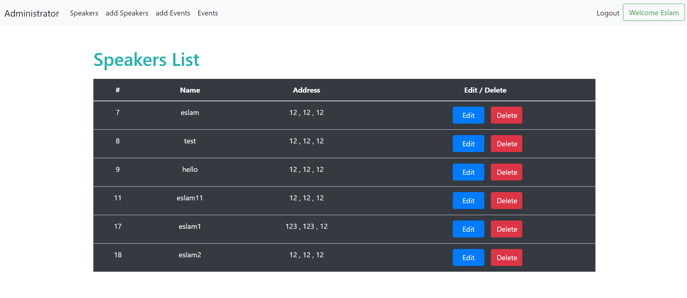
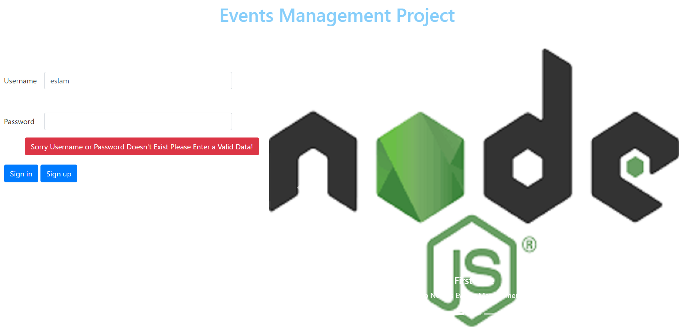
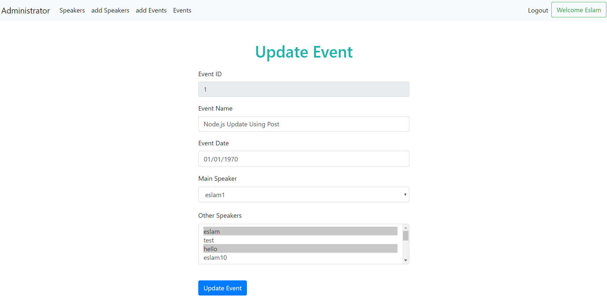
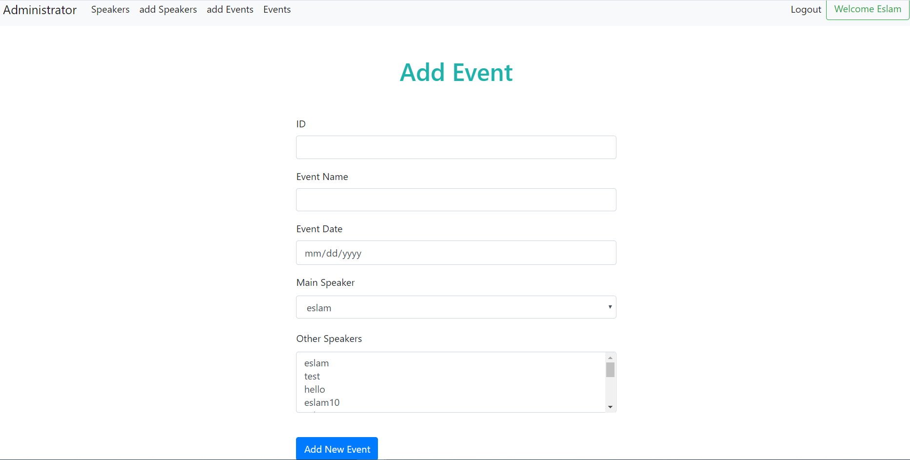
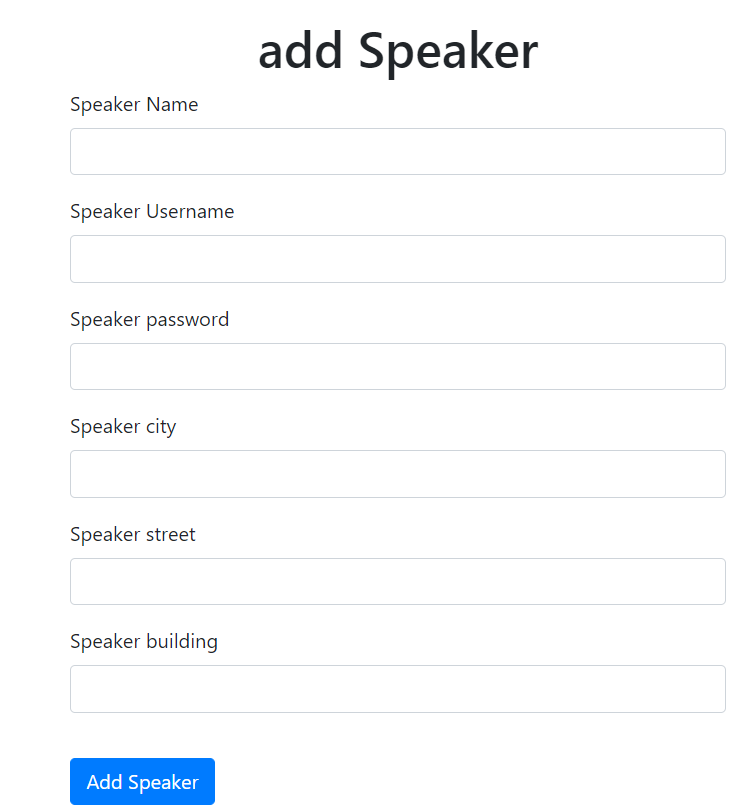

# Nodejs-Event-Management-Project
### This Project About Events Management in ITI Within Speakers Profiles And Admins Panel Using Nodejs , Mongoose ,EJS Views And Ajax Requests
### -Project Dependencies
<pre>
1-Nodejs
2-MongoDB
3-MVC Design Pattern
4-Jquery Ajax
5-Bootstrap
6-HTML
7-CSS
</pre>
### -Project Requirements
<pre>
1-Login / Signup For (Speakers & Admins)
2-MongoDB Schema Model
3-Administration Functionality
- Remove,Edit,Add and Delete Speakers
- Add, Edit and remove events
4-Session Validation (Using Connect Flash)
5-Data Validation Using Express Validator
6-Speaker Can Edit his Own Profile Data
7-Speaker Can See All Available Events On The Website
8-speaker can decline the event , and in this case Administrator should know to replace
the speaker with another one
</pre>
### -Packages
<pre>
1-Auto Increment Package
2-momment Js For Event Date FORM IN HTML
3-Express Session 
4-Connect Flash For Validation
</pre>

### -Project Pictures

